# EcoloGRAPH — Architecture Diagrams

> Visual overview of the system architecture, data flow, and component interactions.

---

## 1. High-Level System Architecture

```mermaid
graph TB
    subgraph User Layer
        UI["🖥️ Streamlit UI"]
        CLI["⌨️ Chat Demo (Terminal)"]
    end

    subgraph Agent Layer
        QA["🤖 Query Agent<br/>(LangGraph)"]
        TR["🔧 Tool Registry<br/>(7 tools)"]
    end

    subgraph Storage Layer
        SQL["💾 SQLite FTS5<br/>(Paper Index)"]
        QD["🧲 Qdrant<br/>(Vector Store)"]
        N4J["🕸️ Neo4j<br/>(Knowledge Graph)"]
    end

    subgraph Processing Layer
        ING["📥 Ingestion<br/>(PDF Parser + Chunker)"]
        EXT["🏷️ Extraction<br/>(Classifier + Entity Extractor)"]
        INF["🔗 Inference<br/>(Linker + Proposer)"]
    end

    subgraph External APIs
        FB["🐟 FishBase"]
        GBIF["🌍 GBIF"]
        IUCN["🛡️ IUCN"]
        LLM["🧠 Local LLM<br/>(LM Studio / Ollama)"]
    end

    UI --> QA
    CLI --> QA
    QA --> TR
    TR --> SQL
    TR --> QD
    TR --> N4J
    TR --> INF
    TR --> FB
    TR --> GBIF
    TR --> IUCN
    ING --> EXT
    EXT --> SQL
    EXT --> QD
    EXT --> N4J
    EXT --> LLM
    QA --> LLM

    style UI fill:#1a2332,stroke:#10b981,color:#e2e8f0
    style CLI fill:#1a2332,stroke:#10b981,color:#e2e8f0
    style QA fill:#1a2332,stroke:#3b82f6,color:#e2e8f0
    style TR fill:#1a2332,stroke:#3b82f6,color:#e2e8f0
    style SQL fill:#1a2332,stroke:#f59e0b,color:#e2e8f0
    style QD fill:#1a2332,stroke:#f59e0b,color:#e2e8f0
    style N4J fill:#1a2332,stroke:#f59e0b,color:#e2e8f0
    style LLM fill:#1a2332,stroke:#8b5cf6,color:#e2e8f0
```

---

## 2. Ingestion Pipeline Flow

```mermaid
flowchart LR
    PDF["📄 PDF Files"] --> PARSE["📖 PDF Parser<br/>(Docling)"]
    PARSE --> CHUNK["📦 Chunker<br/>(Section-aware)"]
    CHUNK --> CLASS["🏷️ Classifier<br/>(43 domains)"]
    CLASS --> EXTRACT["🧬 Entity Extractor<br/>(LLM)"]
    
    CHUNK --> SQLITE["💾 SQLite<br/>FTS5 Index"]
    CHUNK --> QDRANT["🧲 Qdrant<br/>Embeddings"]
    EXTRACT --> NEO4J["🕸️ Neo4j<br/>Graph"]

    style PDF fill:#0f1419,stroke:#64748b,color:#e2e8f0
    style PARSE fill:#1a2332,stroke:#10b981,color:#e2e8f0
    style CHUNK fill:#1a2332,stroke:#10b981,color:#e2e8f0
    style CLASS fill:#1a2332,stroke:#3b82f6,color:#e2e8f0
    style EXTRACT fill:#1a2332,stroke:#8b5cf6,color:#e2e8f0
    style SQLITE fill:#1a2332,stroke:#f59e0b,color:#e2e8f0
    style QDRANT fill:#1a2332,stroke:#f59e0b,color:#e2e8f0
    style NEO4J fill:#1a2332,stroke:#f59e0b,color:#e2e8f0
```

### Pipeline Steps Detail

| Step | Module | Input | Output |
|------|--------|-------|--------|
| 1. Parse | `pdf_parser.py` | PDF file | `ParsedDocument` (text, sections, tables, metadata) |
| 2. Chunk | `chunker.py` | `ParsedDocument` | `list[DocumentChunk]` (1000 chars, 200 overlap) |
| 3. Classify | `domain_classifier.py` | Document text | `ClassificationResult` (primary domain, scores) |
| 4. Extract | `entity_extractor.py` | Chunks + LLM | Species, measurements, locations, relations |
| 5. Index | `paper_index.py` | Metadata | SQLite FTS5 record |
| 6. Embed | `vector_store.py` | Chunks | Qdrant vectors (384-dim) |
| 7. Graph | `graph_builder.py` | Entities | Neo4j nodes + relationships |

---

## 3. Agent Architecture (Two-Tier)

### Tier 1: Fast Router
- **Regex pre-filter**: catches `/help`, `/info`, greetings
- **Minimal LLM call**: classify remaining queries as meta/chat/research
- **Response time**: < 500ms for meta/chat

### Tier 2: Full Agent (ReAct Loop)
- **System prompt**: domain-aware with tool descriptions
- **Tool selection**: LLM decides which tools to call
- **Iterative**: can call multiple tools before answering
- **Streaming**: output streamed token-by-token

---

## 4. Knowledge Graph Schema (Neo4j)

### Cypher Query Templates (14)
| Query | Purpose |
|-------|---------|
| `SPECIES_PROFILE` | Full species info with papers and measurements |
| `ECOLOGICAL_NETWORK` | N-hop relationship traversal |
| `FOOD_WEB` | Predator-prey chains |
| `SPECIES_CO_OCCURRENCE` | Species appearing in same papers |
| `MEASUREMENT_SYNTHESIS` | Aggregate measurements across papers |
| `SPATIAL_QUERY` | Location-based species search |
| `DOMAIN_PAPERS` | Papers by scientific domain |
| `CROSS_DOMAIN_SPECIES` | Species studied across multiple domains |

---

## 5. Search Architecture (Three-Stage Hybrid)

```mermaid
flowchart TB
    Q["🔍 User Query"] --> BM25["Stage 1: BM25<br/>SQLite FTS5"]
    Q --> SEM["Stage 2: Semantic<br/>Qdrant Embeddings"]
    BM25 --> RERANK["Stage 3: Reranker<br/>Score Fusion"]
    SEM --> RERANK
    RERANK --> RESULTS["📊 Ranked Results"]

    style Q fill:#0f1419,stroke:#10b981,color:#e2e8f0
    style BM25 fill:#1a2332,stroke:#f59e0b,color:#e2e8f0
    style SEM fill:#1a2332,stroke:#3b82f6,color:#e2e8f0
    style RERANK fill:#1a2332,stroke:#8b5cf6,color:#e2e8f0
    style RESULTS fill:#1a2332,stroke:#10b981,color:#e2e8f0
```

| Stage | Method | Strengths |
|-------|--------|-----------|
| BM25 | SQLite FTS5 keyword matching | Exact terms, rare words, precision |
| Semantic | Qdrant all-MiniLM-L6-v2 | Synonyms, paraphrases, concepts |
| Reranking | Weighted score fusion | Combines both signals |

---

## 6. Streamlit UI Architecture

```mermaid
graph TB
    APP["scripts/app.py<br/>Entry Point"] --> SIDEBAR["Sidebar Navigation"]
    SIDEBAR --> P1["📊 Dashboard"]
    SIDEBAR --> P2["🔍 Search"]
    SIDEBAR --> P3["🐟 Species"]
    SIDEBAR --> P4["🔬 Domain Lab"]

    P1 --> STATS["PaperIndex.count()"]
    P2 --> RS["RankedSearch"]
    P3 --> SCRAPER["FishBase / GBIF / IUCN"]
    P4 --> DC["DomainClassifier"]
    P4 --> CDL["CrossDomainLinker"]
    P4 --> IP["InferenceProposer"]

    THEME["theme.py<br/>CSS + Components"] --> P1
    THEME --> P2
    THEME --> P3
    THEME --> P4

    style APP fill:#1a2332,stroke:#10b981,color:#e2e8f0
    style THEME fill:#1a2332,stroke:#8b5cf6,color:#e2e8f0
```

---

## 7. Domain Affinity Network (subset)

---

## 8. Infrastructure Deployment

### Ports Summary

| Service | Port(s) | Protocol | Docker Command |
|---------|---------|----------|----------------|
| LM Studio | 1234 | HTTP (OpenAI-compatible) | Native app |
| Qdrant | 6333 | HTTP/gRPC | `docker run -d --name qdrant -p 6333:6333 qdrant/qdrant` |
| Neo4j | 7474, 7687 | HTTP, Bolt | `docker run -d --name neo4j -p 7474:7474 -p 7687:7687 -e NEO4J_AUTH=neo4j/password neo4j` |
| SQLite | — | File I/O | No server needed |
| Streamlit | 8501 | HTTP | `streamlit run scripts/app.py` |
