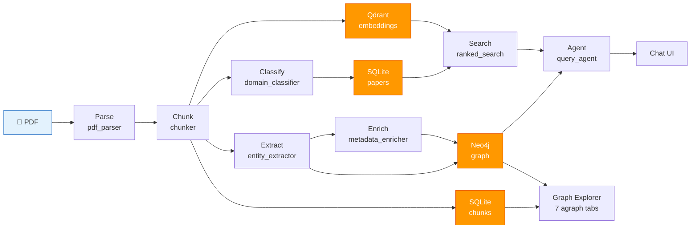

# EcoloGRAPH — Architecture Map

> Auto-generated diagram of all project scripts, modules, and their relationships.

---

## Project Structure

```
EcoloGRAPH/
├── scripts/                        # Entry points & utilities
│   ├── app.py                      # Streamlit launcher
│   ├── ingest.py                   # Main ingestion pipeline
│   ├── backfill_chunks.py          # Backfill SQLite chunks via PyMuPDF
│   ├── demo_pipeline.py            # Full pipeline demo
│   ├── chat_demo.py                # Standalone chat demo
│   ├── verify_setup.py             # Environment health check
│   ├── ingestion_report.py         # Ingestion statistics
│   ├── query_chunks.py             # Query Qdrant chunks
│   ├── query_chunks_lite.py        # Query chunks (no heavy deps)
│   ├── diagnose_agent.py           # Agent diagnostics
│   ├── fix_fts5.py                 # Repair FTS5 index
│   ├── fix_paper_metadata.py       # Repair paper metadata
│   ├── rebuild_fts.py              # Rebuild FTS from scratch
│   ├── repair_neo4j_titles.py      # Fix Neo4j paper titles
│   ├── test_domain_classifier.py   # Test domain classification
│   ├── test_enrichment.py          # Test enrichment pipeline
│   ├── test_extraction.py          # Test entity extraction
│   ├── test_full_pipeline.py       # Test end-to-end pipeline
│   ├── test_ollama_models.py       # Test LLM models
│   └── test_parse_sample.py        # Test PDF parsing
│
├── src/
│   ├── ingestion/                  # Layer 1: PDF → Chunks
│   │   ├── pdf_parser.py
│   │   ├── chunker.py
│   │   └── chunker_phase6.py
│   │
│   ├── extraction/                 # Layer 2: Chunks → Entities
│   │   ├── entity_extractor.py
│   │   ├── domain_classifier.py
│   │   └── citation_extractor.py
│   │
│   ├── enrichment/                 # Layer 3: Metadata Enrichment
│   │   ├── metadata_enricher.py
│   │   ├── crossref_client.py
│   │   ├── semantic_scholar_client.py
│   │   └── taxonomy_resolver.py
│   │
│   ├── graph/                      # Layer 4: Knowledge Graph
│   │   ├── graph_builder.py
│   │   ├── neo4j_analytics.py
│   │   ├── network_analysis.py
│   │   └── queries.py
│   │
│   ├── search/                     # Layer 5: Search & Index
│   │   ├── paper_index.py
│   │   ├── ranked_search.py
│   │   ├── ingestion_ledger.py
│   │   └── query_logger.py
│   │
│   ├── retrieval/                  # Layer 6: Vector Search
│   │   ├── vector_store.py
│   │   └── hybrid_retriever.py
│   │
│   ├── inference/                  # Layer 7: Intelligence
│   │   ├── cross_domain_linker.py
│   │   └── inference_proposer.py
│   │
│   ├── scrapers/                   # Layer 8: External APIs
│   │   ├── gbif_occurrence_client.py
│   │   ├── iucn_client.py
│   │   ├── fishbase_client.py
│   │   └── validate_species_snippet.py
│   │
│   ├── agent/                      # Layer 9: AI Agent
│   │   ├── query_agent.py
│   │   ├── tool_registry.py
│   │   └── tool_groups.py
│   │
│   ├── core/                       # Shared infrastructure
│   │   ├── config.py
│   │   ├── domain_registry.py
│   │   ├── llm_client.py
│   │   ├── lm_studio_manager.py
│   │   ├── schemas.py
│   │   └── token_utils.py
│   │
│   └── ui/                         # Streamlit UI
│       ├── theme.py
│       ├── theme_light.py
│       ├── components/
│       │   ├── entity_highlighter.py
│       │   └── export_utils.py
│       └── pages/
│           ├── dashboard.py
│           ├── graph_explorer_v2.py
│           ├── papers.py
│           ├── search.py
│           ├── chat.py
│           ├── species.py
│           ├── species_validation.py
│           └── domain_lab.py
│
├── config/
│   ├── Logo_EcoloGRAPH.png
│   ├── prompts/                    # LLM prompt templates
│   └── schemas/                    # JSON schemas
│
├── data/
│   ├── paper_index.db              # SQLite (papers + chunks)
│   └── papers/                     # Source PDFs
│
├── tests/
│   ├── conftest.py
│   ├── test_integration.py
│   ├── test_paper_extraction.py
│   ├── test_token_utils.py
│   ├── unit/
│   └── integration/
│
├── docs/                           # Documentation
│   ├── 01_project_documentation.md
│   ├── 02_development_log.md
│   ├── 03_recent_updates.md
│   ├── 03_tutorial.md
│   ├── 04_architecture_diagrams.md
│   ├── 05_module_summary.md
│   ├── 06_testing_guide.md
│   └── 07_architecture_map.md     # ← this file
│
├── pyproject.toml
├── requirements.txt
├── README.md
├── ARCHITECTURE.md
├── CHANGELOG.md
├── CONTRIBUTING.md
├── CONTRIBUTORS.md
└── LICENSE
```

---

## Full Dependency Diagram

```mermaid
flowchart TB

    %% ════════════════════════════════════════════
    %% DATA STORES
    %% ════════════════════════════════════════════
    subgraph DATA["💾 Data Stores"]
        PDFS["📁 data/papers/*.pdf"]
        SQLITE[("SQLite\npaper_index.db\npapers · chunks · ledger")]
        NEO4J[("Neo4j\nKnowledge Graph\nPaper · Species · Location")]
        QDRANT[("Qdrant\nVector Store\nembeddings")]
    end

    %% ════════════════════════════════════════════
    %% CORE (shared by everything)
    %% ════════════════════════════════════════════
    subgraph CORE["⚙️ src/core"]
        CFG["config.py\nApp settings"]
        DR["domain_registry.py\n43 scientific domains"]
        LLM["llm_client.py\nOllama · LM Studio"]
        LMS["lm_studio_manager.py\nLM Studio lifecycle"]
        SCH["schemas.py\nData models"]
        TU["token_utils.py\nToken counting"]
    end

    %% ════════════════════════════════════════════
    %% LAYER 1: INGESTION
    %% ════════════════════════════════════════════
    subgraph L1["📥 src/ingestion — Layer 1: Parse & Chunk"]
        PARSER["pdf_parser.py\nPDF → ParsedDocument\n(docling + PyMuPDF)"]
        CHUNKER["chunker.py\nDocument → DocumentChunk[]\nsection-aware splitting"]
        CHUNKER6["chunker_phase6.py\nHierarchical chunking\nparent + children"]
    end

    %% ════════════════════════════════════════════
    %% LAYER 2: EXTRACTION
    %% ════════════════════════════════════════════
    subgraph L2["🔬 src/extraction — Layer 2: Classify & Extract"]
        DOM_CLS["domain_classifier.py\n43-domain multi-label\n+ study_type detection"]
        ENT_EXT["entity_extractor.py\nLLM-powered extraction\nSpecies · Locations · Methods"]
        CIT_EXT["citation_extractor.py\nDOI & reference parsing"]
    end

    %% ════════════════════════════════════════════
    %% LAYER 3: ENRICHMENT
    %% ════════════════════════════════════════════
    subgraph L3["🌐 src/enrichment — Layer 3: External Enrichment"]
        META["metadata_enricher.py\nOrchestrator"]
        CREF["crossref_client.py\nCrossRef API"]
        SEMSC["semantic_scholar_client.py\nSemantic Scholar API"]
        TAXON["taxonomy_resolver.py\nTaxonomy resolution"]
    end

    %% ════════════════════════════════════════════
    %% LAYER 4: GRAPH
    %% ════════════════════════════════════════════
    subgraph L4["🕸️ src/graph — Layer 4: Knowledge Graph"]
        GB["graph_builder.py\nNeo4j CRUD\nadd_paper · add_extraction_result\nget_paper_chunks (SQLite→Qdrant)"]
        NA["neo4j_analytics.py\nCypher analytics queries"]
        NW["network_analysis.py\nNetworkX centrality\ncommunity detection"]
        QR["queries.py\nReusable Cypher templates"]
    end

    %% ════════════════════════════════════════════
    %% LAYER 5: SEARCH
    %% ════════════════════════════════════════════
    subgraph L5["🔍 src/search — Layer 5: SQLite Index"]
        PI["paper_index.py\nPaperIndex: papers + chunks\nFTS5 full-text search"]
        RS["ranked_search.py\nHybrid BM25 + semantic\nRankedSearch"]
        LEDGER["ingestion_ledger.py\nTrack ingested files\nskip duplicates"]
        QLOG["query_logger.py\nLog user queries\nanalytics"]
    end

    %% ════════════════════════════════════════════
    %% LAYER 6: RETRIEVAL
    %% ════════════════════════════════════════════
    subgraph L6["🧲 src/retrieval — Layer 6: Vector Search"]
        VS["vector_store.py\nQdrant CRUD\nSentenceTransformer embeddings"]
        HR["hybrid_retriever.py\nSemantic + keyword fusion"]
    end

    %% ════════════════════════════════════════════
    %% LAYER 7: INFERENCE
    %% ════════════════════════════════════════════
    subgraph L7["🧠 src/inference — Layer 7: Intelligence"]
        CDL["cross_domain_linker.py\nBridge detection\nacross 43 domains"]
        INF["inference_proposer.py\nResearch hypothesis\ngeneration"]
    end

    %% ════════════════════════════════════════════
    %% LAYER 8: SCRAPERS
    %% ════════════════════════════════════════════
    subgraph L8["🌍 src/scrapers — Layer 8: External Data"]
        GBIF["gbif_occurrence_client.py\nSpecies occurrences"]
        IUCN["iucn_client.py\nIUCN Red List status"]
        FISH["fishbase_client.py\nFishBase data"]
        VSNIP["validate_species_snippet.py\nSpecies name validation"]
    end

    %% ════════════════════════════════════════════
    %% LAYER 9: AGENT
    %% ════════════════════════════════════════════
    subgraph L9["🤖 src/agent — Layer 9: AI Agent"]
        QA["query_agent.py\nConversational agent\nchain-of-thought reasoning"]
        TREG["tool_registry.py\n30+ tools\ngraph · search · scraper tools"]
        TGRP["tool_groups.py\nTool categories"]
    end

    %% ════════════════════════════════════════════
    %% UI
    %% ════════════════════════════════════════════
    subgraph UI["🖥️ src/ui — Streamlit Interface"]
        THEME["theme.py · theme_light.py"]
        subgraph PAGES["pages/"]
            P_DASH["dashboard.py\n📊 Stats & overview"]
            P_GE["graph_explorer_v2.py\n🕸️ 7 agraph tabs\nExplorer · Species · Domains\nPapers · Methods · Authors · Locations"]
            P_PAP["papers.py\n📄 Paper browser"]
            P_SRC["search.py\n🔍 Hybrid search"]
            P_CHAT["chat.py\n💬 AI assistant"]
            P_SPEC["species.py\n🐾 Species explorer"]
            P_SVAL["species_validation.py\n✅ Species validation"]
            P_DLAB["domain_lab.py\n🧪 Domain lab"]
        end
        subgraph COMPS["components/"]
            EH["entity_highlighter.py\nHighlight entities in text"]
            EU["export_utils.py\nExport graphs & CSV"]
        end
    end

    %% ════════════════════════════════════════════
    %% ENTRY POINTS
    %% ════════════════════════════════════════════
    subgraph ENTRY["🚀 scripts/ — Entry Points"]
        S_APP["app.py\nStreamlit launcher"]
        S_ING["ingest.py\nIngestion pipeline"]
        S_BF["backfill_chunks.py\nPyMuPDF chunk backfill"]
        S_DEMO["demo_pipeline.py\nFull pipeline demo"]
        S_CHAT["chat_demo.py\nStandalone chat"]
        S_VER["verify_setup.py\nHealth check"]
        S_REP["ingestion_report.py\nStats report"]
    end

    subgraph REPAIR["🔧 scripts/ — Repair"]
        R_FTS["fix_fts5.py"]
        R_META["fix_paper_metadata.py"]
        R_REB["rebuild_fts.py"]
        R_NEO["repair_neo4j_titles.py"]
    end

    subgraph DIAG["🔍 scripts/ — Query & Diagnostics"]
        D_QC["query_chunks.py"]
        D_QCL["query_chunks_lite.py"]
        D_AGN["diagnose_agent.py"]
    end

    subgraph TESTS["🧪 scripts/ — Testing"]
        T_DC["test_domain_classifier.py"]
        T_EN["test_enrichment.py"]
        T_EX["test_extraction.py"]
        T_FP["test_full_pipeline.py"]
        T_OL["test_ollama_models.py"]
        T_PS["test_parse_sample.py"]
    end

    subgraph DOCS["📚 Documentation"]
        DOC1["01_project_documentation.md"]
        DOC2["02_development_log.md"]
        DOC3["03_recent_updates.md"]
        DOC4["03_tutorial.md"]
        DOC5["04_architecture_diagrams.md"]
        DOC6["05_module_summary.md"]
        DOC7["06_testing_guide.md"]
        DOC8["07_architecture_map.md"]
        README["README.md"]
        ARCH["ARCHITECTURE.md"]
        CHANGE["CHANGELOG.md"]
        CONTRIB["CONTRIBUTING.md"]
    end

    subgraph CONF["📋 Config & Build"]
        PYPROJ["pyproject.toml"]
        REQS["requirements.txt"]
        ENV[".env / .env.example"]
        PROMPTS["config/prompts/\nLLM prompt templates"]
        SCHEMAS_C["config/schemas/\nJSON schemas"]
        LOGO["config/Logo_EcoloGRAPH.png"]
    end

    %% ════════════════════════════════════════════
    %% RELATIONSHIPS — INGESTION PIPELINE
    %% ════════════════════════════════════════════
    S_ING ==>|"1. parse"| PARSER
    PDFS -->|"reads"| PARSER
    PARSER ==>|"ParsedDocument"| CHUNKER
    CHUNKER ==>|"DocumentChunk[]"| S_ING
    S_ING ==>|"2. classify"| DOM_CLS
    S_ING ==>|"3. index papers"| PI
    S_ING ==>|"3b. store chunks"| PI
    S_ING ==>|"4. embed"| VS
    S_ING ==>|"5. extract entities"| ENT_EXT
    S_ING ==>|"6. build graph"| GB
    S_ING ==>|"7. enrich"| META
    S_ING -->|"track"| LEDGER

    %% ════════════════════════════════════════════
    %% RELATIONSHIPS — DATA STORES
    %% ════════════════════════════════════════════
    PI -->|"read/write"| SQLITE
    LEDGER -->|"read/write"| SQLITE
    QLOG -->|"write"| SQLITE
    GB -->|"read/write"| NEO4J
    NA -->|"query"| NEO4J
    QR -->|"templates for"| NEO4J
    VS -->|"read/write"| QDRANT
    GB -.->|"get_paper_chunks\nSQLite first"| SQLITE
    GB -.->|"fallback"| QDRANT

    %% ════════════════════════════════════════════
    %% RELATIONSHIPS — CORE DEPS
    %% ════════════════════════════════════════════
    DOM_CLS -->|"uses"| DR
    DOM_CLS -->|"uses"| LLM
    ENT_EXT -->|"uses"| LLM
    ENT_EXT -->|"uses"| SCH
    ENT_EXT -->|"uses"| TU
    CIT_EXT -->|"uses"| SCH
    LLM -->|"manages"| LMS
    CDL -->|"uses"| LLM
    CDL -->|"reads"| GB
    INF -->|"uses"| LLM
    INF -->|"reads"| GB
    QA -->|"uses"| LLM

    %% ════════════════════════════════════════════
    %% RELATIONSHIPS — ENRICHMENT
    %% ════════════════════════════════════════════
    META --> CREF
    META --> SEMSC
    META --> TAXON
    TAXON --> GBIF

    %% ════════════════════════════════════════════
    %% RELATIONSHIPS — SEARCH/RETRIEVAL
    %% ════════════════════════════════════════════
    RS -->|"keyword"| PI
    RS -->|"semantic"| VS
    HR -->|"semantic"| VS
    HR -->|"filter"| PI

    %% ════════════════════════════════════════════
    %% RELATIONSHIPS — AGENT
    %% ════════════════════════════════════════════
    QA --> TREG
    TREG --> TGRP
    TREG -->|"graph tools"| GB
    TREG -->|"search tools"| PI
    TREG -->|"search tools"| RS
    TREG -->|"inference tools"| CDL
    TREG -->|"inference tools"| INF
    TREG -->|"scraper tools"| GBIF
    TREG -->|"scraper tools"| IUCN
    TREG -->|"scraper tools"| FISH

    %% ════════════════════════════════════════════
    %% RELATIONSHIPS — UI
    %% ════════════════════════════════════════════
    S_APP ==>|"launches"| UI
    P_DASH -->|"stats"| PI
    P_DASH -->|"stats"| GB
    P_GE -->|"graph data"| GB
    P_GE -->|"paper data"| PI
    P_GE -->|"analytics"| NA
    P_GE -->|"analysis"| NW
    P_GE -->|"highlight"| EH
    P_GE -->|"export"| EU
    P_PAP -->|"browse"| PI
    P_SRC -->|"hybrid search"| RS
    P_CHAT -->|"agent"| QA
    P_SPEC -->|"graph"| GB
    P_SPEC -->|"external"| GBIF
    P_SPEC -->|"external"| IUCN
    P_SVAL -->|"validate"| VSNIP
    P_DLAB -->|"domains"| DR
    PAGES -->|"styled by"| THEME

    %% ════════════════════════════════════════════
    %% RELATIONSHIPS — BACKFILL
    %% ════════════════════════════════════════════
    S_BF -->|"reads"| PDFS
    S_BF -->|"writes chunks"| SQLITE

    %% ════════════════════════════════════════════
    %% RELATIONSHIPS — REPAIR SCRIPTS
    %% ════════════════════════════════════════════
    R_FTS -->|"repairs"| SQLITE
    R_META -->|"repairs"| SQLITE
    R_REB -->|"rebuilds"| SQLITE
    R_NEO -->|"repairs"| NEO4J

    %% ════════════════════════════════════════════
    %% RELATIONSHIPS — DIAGNOSTICS
    %% ════════════════════════════════════════════
    D_QC -->|"queries"| QDRANT
    D_QCL -->|"queries"| SQLITE
    D_AGN -->|"tests"| QA

    %% ════════════════════════════════════════════
    %% RELATIONSHIPS — TEST SCRIPTS
    %% ════════════════════════════════════════════
    T_DC -->|"tests"| DOM_CLS
    T_EN -->|"tests"| META
    T_EX -->|"tests"| ENT_EXT
    T_FP -->|"tests"| S_ING
    T_OL -->|"tests"| LLM
    T_PS -->|"tests"| PARSER

    %% ════════════════════════════════════════════
    %% RELATIONSHIPS — OTHER SCRIPTS
    %% ════════════════════════════════════════════
    S_DEMO -->|"runs"| S_ING
    S_CHAT -->|"uses"| QA
    S_VER -->|"checks"| CFG
    S_REP -->|"reads"| SQLITE

    %% ════════════════════════════════════════════
    %% RELATIONSHIPS — DOCS
    %% ════════════════════════════════════════════
    PROMPTS -.->|"prompts for"| ENT_EXT
    PROMPTS -.->|"prompts for"| DOM_CLS
    SCHEMAS_C -.->|"schemas for"| SCH
    DOC6 -.->|"documents"| L1
    DOC6 -.->|"documents"| L2
    DOC6 -.->|"documents"| L3
    DOC6 -.->|"documents"| L4
    DOC7 -.->|"documents"| TESTS
    PYPROJ -.->|"build config"| REQS
    ENV -.->|"env vars"| CFG

    %% ════════════════════════════════════════════
    %% STYLING
    %% ════════════════════════════════════════════
    classDef dataStore fill:#FF9800,stroke:#E65100,color:#fff,font-weight:bold
    classDef entry fill:#4CAF50,stroke:#2E7D32,color:#fff
    classDef repair fill:#78909C,stroke:#455A64,color:#fff
    classDef test fill:#607D8B,stroke:#37474F,color:#fff
    classDef diag fill:#8D6E63,stroke:#4E342E,color:#fff
    classDef doc fill:#B0BEC5,stroke:#546E7A,color:#333

    class PDFS,SQLITE,NEO4J,QDRANT dataStore
    class S_APP,S_ING,S_BF,S_DEMO,S_CHAT,S_VER,S_REP entry
    class R_FTS,R_META,R_REB,R_NEO repair
    class T_DC,T_EN,T_EX,T_FP,T_OL,T_PS test
    class D_QC,D_QCL,D_AGN diag
    class DOC1,DOC2,DOC3,DOC4,DOC5,DOC6,DOC7,DOC8,README,ARCH,CHANGE,CONTRIB doc
```



---

## Data Flow (simplified)



---

## Module-to-Module Import Map

| Module | Imports from |
|--------|-------------|
| `scripts/ingest.py` | ingestion, extraction, enrichment, graph, search, retrieval, core |
| `scripts/backfill_chunks.py` | *(standalone: fitz + sqlite3 only)* |
| `scripts/app.py` | ui (all pages) |
| `src/ingestion/chunker.py` | ingestion/pdf_parser |
| `src/extraction/entity_extractor.py` | core/llm_client, core/schemas, core/token_utils |
| `src/extraction/domain_classifier.py` | core/domain_registry, core/llm_client |
| `src/enrichment/metadata_enricher.py` | enrichment/crossref, semantic_scholar, taxonomy_resolver |
| `src/graph/graph_builder.py` | search/paper_index *(SQLite chunks)*, retrieval/vector_store *(Qdrant fallback)* |
| `src/search/ranked_search.py` | search/paper_index, retrieval/vector_store |
| `src/retrieval/hybrid_retriever.py` | retrieval/vector_store, search/paper_index |
| `src/inference/cross_domain_linker.py` | graph/graph_builder, core/llm_client |
| `src/inference/inference_proposer.py` | graph/graph_builder, core/llm_client |
| `src/agent/query_agent.py` | agent/tool_registry, core/llm_client |
| `src/agent/tool_registry.py` | graph, search, inference, scrapers |
| `src/ui/pages/graph_explorer_v2.py` | graph/graph_builder, search/paper_index, graph/neo4j_analytics |
| `src/ui/pages/chat.py` | agent/query_agent |
| `src/ui/pages/search.py` | search/ranked_search |
| `src/ui/pages/papers.py` | search/paper_index |
| `src/ui/pages/species.py` | graph/graph_builder, scrapers |
| `src/ui/pages/dashboard.py` | search/paper_index, graph/graph_builder |
