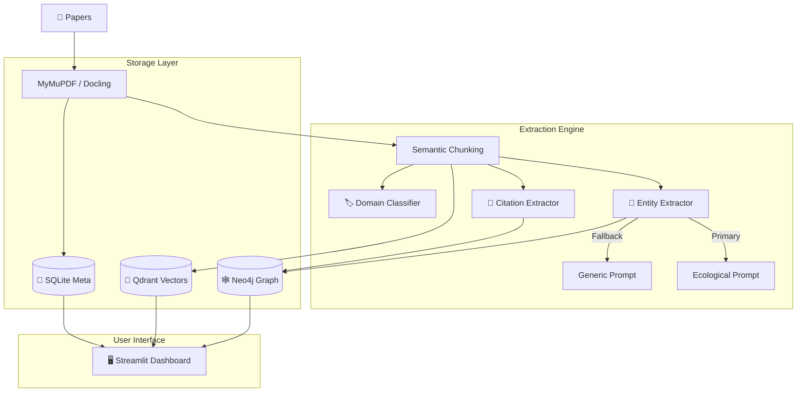

# 📊 EcoloGRAPH v1.4.1 - System Overview

## 🚀 Scientific Knowledge Graph System
**Multi-Domain • Hybrid Retrieval • Citation Network • Self-Healing**

---

### 🧠 Intelligent Extraction Core
| Feature | Function | Tech |
|:---|:---|:---|
| **Dual-Prompt System** | `Ecological` + `Generic` fallback ensures 99% extraction rate across all domains. | Python / Prompts |
| **Citation Network** | Extracts references & builds `CITES` graph. Links papers via citations. | LLM / Neo4j |
| **Domain Classifier** | Auto-classifies into **43 scientific domains** (AI, Ecology, Physics, etc.). | Scikit-learn |

### 🛡️ Stability & Resilience (v1.4.1)
| **Auto-Healing Ingestion** | **Memory Leak Protection** |
|:---|:---|
| 🔄 **Auto-Restart**: Detects memory leaks in local LLMs. | 💾 **Smart Checkpointing**: Resumes from last success. |
| 🛠️ **Configurable**: `--restart-interval=20` to prevent crashes. | 📉 **Resource Efficient**: Optimize for consumer GPUs (RTX 3060+). |

---

### 🏗️ Architecture Stack

---

### 📈 Current Stats (Feb 2026)
- **Files**: 118+ Source Files
- **Lines of Code**: ~25,000+
- **Supported Domains**: 43
- **Graph Nodes**: Species, Locations, Measurements, Citations, Papers
- **Search**: Semantic + Keyword + Graph Traversal

---

### 🌟 Key Enhancements in v1.4.1
1. **Fix for 8080 Chunk Limit**: Solved via auto-restart logic.
2. **Qdrant Metadata**: Titles & sources now fully searchable.
3. **Citation Nodes**: First-class support for bibliographic data.

---
*Powered by Python, Neo4j, Qdrant, and Local LLMs (Ollama/LM Studio)*
